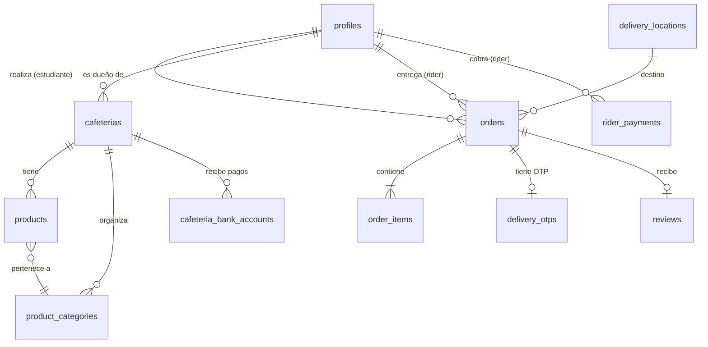

# 🍔 UIDE Campus Delivery

**Plataforma de delivery de comida dentro del campus universitario UIDE.**

Los estudiantes pueden explorar las cafeterías del campus, armar pedidos, pagar con comprobante de transferencia bancaria y recibir su comida en un punto de entrega dentro de la universidad — todo desde una sola app web.

---

## 📖 ¿Qué es este proyecto?

UIDE Campus Delivery conecta tres actores del ecosistema de comida del campus:

| Rol | ¿Qué puede hacer? |
|---|---|
| **🎓 Estudiante** | Explorar menús, hacer pedidos, subir comprobantes de pago y dar reseñas. |
| **🏪 Cafetería** | Gestionar productos, categorías, verificar pagos y preparar pedidos. |
| **🛵 Repartidor** | Recibir pedidos listos, entregarlos en el punto acordado y confirmar con OTP. |
| **🔧 Admin** | Aprobar repartidores, gestionar puntos de entrega y supervisar toda la operación. |

El frontend está construido con **Next.js 16 + React 19** y el backend es **100% Supabase** (PostgreSQL + Auth + Storage + RLS).

---

## 🏗️ Arquitectura del Proyecto

```
└── uidelivery-web/           # Frontend (Next.js)
    ├── src/
    │   ├── app/              # App Router (páginas y layouts)
    │   │   ├── (auth)/       # Rutas protegidas (admin, cafetería, rider, pedidos, etc.)
    │   │   ├── cafeterias/   # Catálogo público de cafeterías
    │   │   ├── login/        # Página de login
    │   │   └── page.tsx      # Landing page
    │   ├── components/       # Componentes reutilizables de UI
    │   ├── lib/              # Clientes Supabase, tipos, utilidades
    │   ├── stores/           # Estado global (Zustand)
    │   └── middleware.ts     # Protección de rutas con Supabase Auth
    ├── bootstrap.sql         # Script SQL para crear tablas en Supabase
    └── .env.example          # Plantilla de variables de entorno
```

---

## ⚙️ Tech Stack

| Capa | Tecnología |
|---|---|
| **Framework** | [Next.js 16](https://nextjs.org/) (App Router + Turbopack) |
| **UI** | [React 19](https://react.dev/), [Tailwind CSS 4](https://tailwindcss.com/), [Framer Motion](https://www.framer.com/motion/) |
| **Iconos** | [Lucide React](https://lucide.dev/) |
| **Estado** | [Zustand](https://zustand.docs.pmnd.rs/) |
| **Backend** | [Supabase](https://supabase.com/) (PostgreSQL, Auth, Storage, RLS) |
| **Notificaciones** | [Sonner](https://sonner.emilkowal.dev/) |
| **Package Manager** | [pnpm](https://pnpm.io/) |

---

## 🚀 Cómo correr el proyecto

### Prerrequisitos

- [Node.js](https://nodejs.org/) v18 o superior
- [pnpm](https://pnpm.io/installation) instalado globalmente (`npm install -g pnpm`)
- Una cuenta en [Supabase](https://supabase.com/) (plan gratuito es suficiente)

---

### 1. Clonar el repositorio

```bash
git clone <URL_DEL_REPOSITORIO>
cd uidelivery-web
```

### 2. Instalar dependencias

```bash
pnpm install
```

### 3. Configurar variables de entorno

Copia el archivo de ejemplo y complétalo con tus credenciales de Supabase:

```bash
cp .env.example .env.local
```

Abre `.env.local` y reemplaza los valores con los de **tu proyecto de Supabase**. Puedes encontrarlos en:

> **Supabase Dashboard → Settings → API**

```env
NEXT_PUBLIC_SUPABASE_URL=https://TU-PROYECTO.supabase.co
NEXT_PUBLIC_SUPABASE_ANON_KEY=tu-anon-key-aquí
```

### 4. Configurar la base de datos en Supabase

Tienes dos opciones para levantar el esquema de la base de datos:

#### Opción A: Usar `bootstrap.sql` (rápido)

1. Ve al **SQL Editor** en tu Dashboard de Supabase.
2. Copia y pega el contenido de [`bootstrap.sql`](./bootstrap.sql).
3. Haz clic en **Run**.

Este script crea:
- Los esquemas `public` y `Cobranzas`
- Los tipos ENUM para roles, estados de pedido, pagos, etc.
- Todas las tablas (perfiles, cafeterías, productos, pedidos, entregas, reseñas…)
- Habilita **Row Level Security (RLS)** en todas las tablas

#### Opción B: Usar migraciones completas (recomendado para producción)

Ejecuta los archivos SQL del directorio `supabase/migrations/` **en orden**:

1. **`001_uide_campus_delivery_complete.sql`** — Esquema completo + funciones + políticas RLS
2. **`002_uide_campus_delivery_seed.sql`** — Datos de prueba (cafeterías, productos, pedidos de ejemplo)
3. **`003_fix_orders_rls.sql`** — Correcciones de políticas RLS para pedidos

```bash
# Desde el SQL Editor de Supabase, ejecuta cada archivo en orden
```

### 5. Configurar Storage (opcional, para imágenes)

Para que las imágenes de productos y comprobantes funcionen correctamente:

1. Crea un bucket **público** llamado `product-images` en **Storage → Buckets**
2. Crea un bucket **privado** llamado `payment-proofs`
3. Sigue las instrucciones detalladas en [`supabase/storage_instructions.md`](../supabase/storage_instructions.md)

### 6. Iniciar el servidor de desarrollo

```bash
pnpm dev
```

Abre [http://localhost:3000](http://localhost:3000) en tu navegador. 🎉

---

## 📊 Modelo de Datos

El proyecto maneja las siguientes entidades principales:



### Tablas principales

| Tabla | Descripción |
|---|---|
| `profiles` | Usuarios del sistema (estudiante, repartidor, cafetería, admin) |
| `cafeterias` | Cafeterías registradas con su dueño y estado |
| `products` | Productos de cada cafetería con precio y disponibilidad |
| `product_categories` | Categorías para organizar el menú |
| `orders` | Pedidos con estado, monto total y comprobante de pago |
| `order_items` | Detalle de productos por pedido |
| `delivery_locations` | Puntos de entrega aprobados dentro del campus |
| `delivery_otps` | Códigos OTP para confirmar entregas |
| `reviews` | Reseñas de 1-5 estrellas por pedido |
| `rider_payments` | Registro de pagos a repartidores |
| `cafeteria_bank_accounts` | Cuentas bancarias de las cafeterías |
| `allowed_email_domains` | Dominios de email permitidos para registro |

---

## 🔐 Seguridad

- **Row Level Security (RLS)** está habilitado en todas las tablas del esquema `public`.
- Las políticas aseguran que cada usuario solo pueda ver y modificar los datos que le corresponden.
- La autenticación se gestiona mediante **Supabase Auth** con soporte para email/password.
- El middleware de Next.js protege las rutas que requieren sesión activa.

---

## 📜 Scripts disponibles

| Comando | Descripción |
|---|---|
| `pnpm dev` | Inicia el servidor de desarrollo con Turbopack |
| `pnpm build` | Genera el build de producción |
| `pnpm start` | Inicia el servidor de producción |
| `pnpm lint` | Ejecuta ESLint para verificar el código |

---

## 🤝 Contribuir

1. Haz fork del repositorio
2. Crea una rama para tu feature: `git checkout -b feature/mi-nueva-feature`
3. Haz commit de tus cambios: `git commit -m "feat: agregar nueva feature"`
4. Haz push a la rama: `git push origin feature/mi-nueva-feature`
5. Abre un Pull Request

---

## 📄 Licencia

Este proyecto fue desarrollado como parte de un **Workshop en la UIDE** (Universidad Internacional del Ecuador) con fines educativos.
